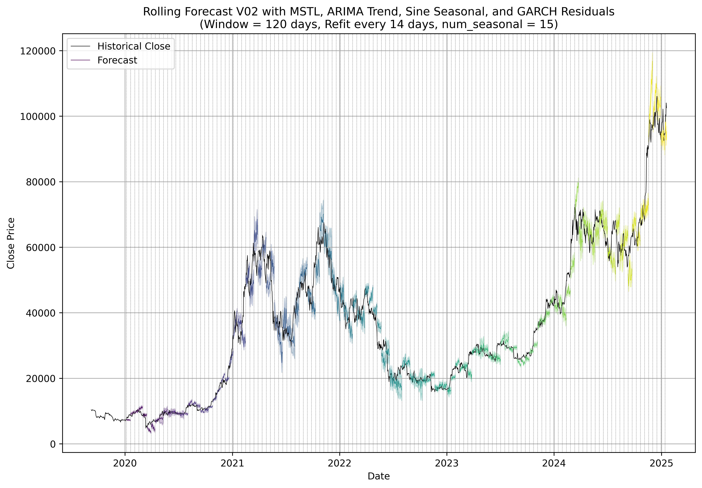
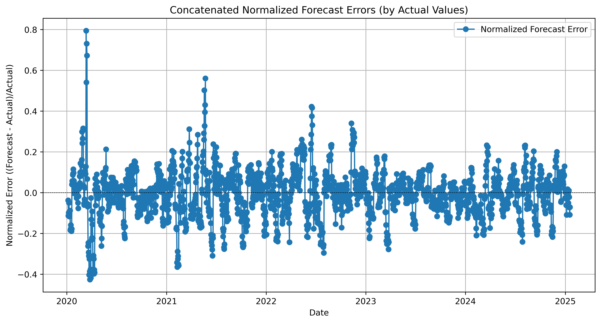

# SeasoCast: Seasonal Forecasting Framework

SeasoCast is an educational project that implements a classical approach to prediction and forecasting problems in stock and crypto markets. The framework integrates multiple well-established techniques to capture the intricate dynamics of time series data, making it a great learning tool for those interested in advanced forecasting methods.

---

## Overview

SeasoCast leverages a combination of time series analysis methods including:
- **FFT-based Seasonal Detection:** Identifies dominant seasonal cycles by computing the FFT on mean-centered data.
- **MSTL Decomposition:** Decomposes the time series into trend, multiple seasonal components, and residuals.
- **Walking Forward ARIMA Trend Forecasting:** Employs a rolling window (walking forward) strategy where an ARIMA model is refit at each window to forecast the trend component.
- **Sine-Cosine Seasonal Forecasting:** Fits sine and cosine functions on the last full cycle of each seasonal component to generate forecasts.
- **GARCH Residual Modeling:** Models residual volatility to produce 95% confidence intervals.
- **Optuna Optimization (Optional):** Provides a mechanism for hyperparameter tuning, although it is commented out by default.

*Note: This repository is intended for educational purposes only.*


---

## Repository Contents

- **`SeasonalMSTLARIMASineGARCH.py`**  
  The main Python script that implements the complete forecasting pipeline.

- **`crypto_data_1D_2017-01-01_to_2025-01-18_20250118_091237.xlsx`**  
  An Excel file containing historical crypto market data with daily frequency.

---

## What you should expect from this code!
---
### Classical Approach to Forecasting
This project adopts a classical methodology by combining traditional statistical models:

Time Series Decomposition: Breaking down a series into its underlying components.
ARIMA Modeling: A staple in time series forecasting, especially with its walking forward training for adapting to changes.
Seasonal Modeling via Sine-Cosine Functions: A method rooted in harmonic analysis to capture cyclic behavior.
GARCH Models: Used for modeling and forecasting volatility.
This blend of techniques provides a robust framework for understanding and predicting complex market dynamics.

---
### Usage
The script is designed to be run directly from the command line. When executed, it will:

#### Load Data:
Read the provided Excel file, parse dates, and set the data frequency to daily.

#### Seasonal Detection:
Use FFT (with mean removal) to detect the top seasonal periods in the data.

#### MSTL Decomposition:
Decompose the time series into its trend, seasonal, and residual components.

#### Walking Forward ARIMA Forecasting:
For each rolling window (refit window), the ARIMA model is retrained (walking forward) on the trend component to capture evolving dynamics. This ensures that the forecast adapts to recent changes in the data.

#### Seasonal Forecasting:
For each detected seasonal component, a sine-cosine function is fitted on its last complete cycle to predict future values.

#### Residual Volatility Forecasting:
A GARCH model is applied to the residuals to compute confidence intervals for the overall forecast.

#### Visualization:
The script plots the historical close prices alongside the forecasts and their confidence intervals. Additional visualizations include normalized forecast error timeseries by actual and predicted values.

#### Hyperparameter Tuning (Optional):
An Optuna objective function is provided to optimize parameters like window size, refit steps, and number of seasonal components. This section is commented out by default.

### Prerequisites

Ensure you have Python 3.7 or higher installed. The following libraries are required:

- numpy
- pandas
- matplotlib
- scipy
- statsmodels
- arch
- optuna
- openpyxl (for reading Excel files)

Install the dependencies using pip:

```bash
pip install numpy pandas matplotlib scipy statsmodels arch optuna openpyxl
